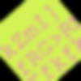
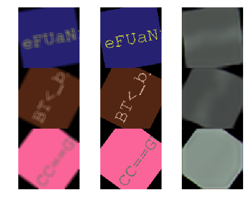
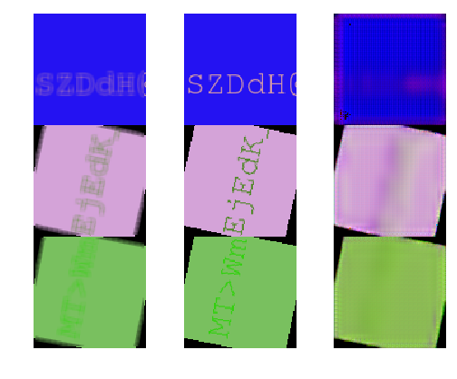
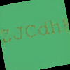

# Unblurring images of text with neural networks

## Introduction

Sharpening images of text is easy for humans. Take for example the following photo:

It is easy for anyone to output the following photo base on the former:

Now we are lazy and don't want to do this over and over so we should 
automate the unblurring with neural networks!

## Development

Training data for this ploblem is eazy to generate.
A simple python script utilizing the PIL library
is all it takes to generate simple images of blurred text and their corresponding labels
(Of course it's not as easy to get real photos of blurred text and their
unblurred conterparts, the generated images will have to do).

Formally, if we
let $F_\theta$ be the neural network which unblurrs images,
$Y_1,Y_2,...,Y_n$ be images and $X_1,X_2,...,X_n$ their blurred conterparts,
then we want to find parameters $\theta$ which satisfy:
\[
	\theta = argmin_{\gamma} \frac{1}{n} \sum_i (Y_i - F_\gamma(X_i))^2
\]
This is simply the mean squared error per pixel between the original image and
the unblurred image.

To solve this problem a few types of architectures were tryed.
All of them, however, were some form of convolutional neural network.

One architecture that was expected to work well was a few convolution layers 
which had the same output dimensions as the input dimension, aside for the number
of channels. This was not the case. After training this model the following
inputs and outputs were obtained:

Clearly the neural network has simply learned the identity function. This is a 
local minima of the cost function and a pretty strong one.
Changing the number of
layers, changing the activation fuctions, changing the cost function and 
changing the number of intermediate channels had no effect on what the net converged to,
the local mimima could not be avoided this way.
Therefore a redesign was needed.

Instead of forcing the output dimensions of the convolutions to be the same
for all the layers, the convolution layers are allowed to shrink the
image. However, to calculate the per pixel mean squared error the output image 
needs to have the same dimension 
as the input image. Therefore deconvolutional layers were needed to 
enlarge the image again.

With this archetecture the network started to fit differently to the data. 
First it learned about the
black parts around the square, then about coloring the square with the correct color.
Then slowly but surely the network learned to output the letters unblurred.

Finding a good learning rate for training turned out to be challanging.
The network would only learn reasonably fast for a learning rate which was
close to a learning rate which made the training diverge. 
A novel method was used to find a good learning rate: simply print out a parameter in 
the neural network (one parameter was used here) and print it out after each iteration.
If it isn't changing: increase the learning rate. If it's changing: if it gets large 
fast then divergence is happening, otherwise this learning rate should be choosen.
This method is of course really simple but yielded great results for this work.

## What I learned

This project was a great learning experience, I learned that:

* Choosing the learning rate can mean the difference between a good result an no result at all.
* Choosing the correct architecture is important in avoiding poor local mimimas.
* Tensorflow is great.

Thanks for reading!

